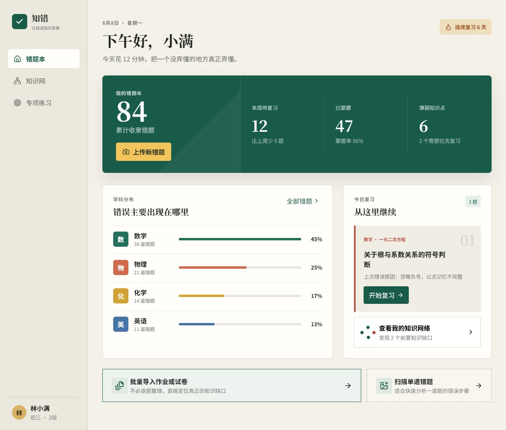
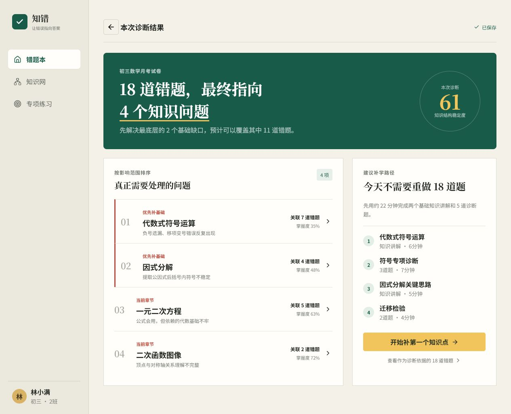
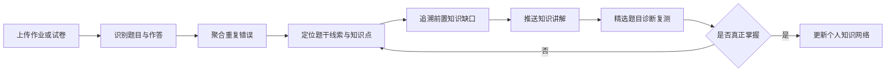

# 知错

> 从真实错题出发，找到学生真正的知识缺口。

**知错**是一款面向中学生的学习诊断产品原型。它不鼓励学生把每道错题重新抄进错题本，而是将作业、练习册和试卷中的错误作为诊断锚点，识别反复出现的知识问题、题干线索识别障碍和知识调用困难，再生成一条更短、更明确的补学路径。

当前项目处于**用户调研与产品原型阶段**。本仓库用于展示产品理念、学生端核心流程和交互方向，不代表相关AI诊断能力已经完成生产验证。



## 为什么做知错

传统错题本的逻辑通常是：

```text
做错一道题 → 抄题和答案 → 查看解析 → 再做类似题
```

但在真实学习过程中，许多学生面临的问题是：

- 错题太多，没有时间逐道整理；
- 不知道“记住答案”和“真正掌握”有什么区别；
- 基础较弱时，当前错题往往只是更早知识缺口的结果；
- 知道某个知识点，却无法从题干条件联想到它；
- 老师讲解速度快，单次课堂讲解难以照顾每个人；
- 通用AI可能生成错误答案，学生缺少判断依据。

对于成绩较好的学生，理解一道错题后可能很快完成迁移；对于基础较弱的学生，继续增加错题数量反而会带来更高的整理成本和挫败感。

因此，我们的核心判断是：

> 错题不是需要逐道收藏的内容，而是定位学生知识结构问题的诊断锚点。

## 产品目标

知错希望将：

```text
18 道分散错题
```

转化为：

```text
4 个知识问题
→ 2 个优先基础缺口
→ 一条约 22 分钟的补学路径
```

学生面对的不再是一堵越来越高的“错题墙”，而是一组可以理解、可以排序、可以逐步解决的问题。



## 目标用户

### 主要使用者

- 初中和高中学生；
- 错题较多、基础知识存在断层的学生；
- 知识点记得住，但难以识别题干线索或选择解题策略的学生。

### 相关角色

- **教师**：校正诊断结果，沉淀题目线索与解题策略，了解班级共性问题；
- **家长**：判断孩子需要补知识、练方法，还是改善题目识别与知识调用；
- **教研人员**：建设可信题库、知识网络和高质量讲解体系。

## 核心诊断框架

知错不把所有错误都归结为“知识点不会”，而是尝试区分：

1. **知识未掌握**：概念、公式或原理尚未理解；
2. **记忆不准确**：公式结构、符号或条件记忆错误；
3. **题干线索未识别**：看到了条件，却不知道它在暗示什么知识；
4. **知识调用错误**：掌握相关知识，但没有在正确情境中调用；
5. **策略选择错误**：知识点正确，但解题路径不合适；
6. **运算执行错误**：计算、符号或书写过程中出现失误。

产品最终需要建立的不只是知识图谱，而是三层关联网络：

```text
题干线索 → 知识点 → 解题策略
```

这套网络希望将优秀教师头脑中的经验结构化：看到什么条件、应该联想到什么、第一步尝试什么，以及学生通常会在哪里卡住。

## 当前原型

### 1. 学生错题本首页

展示累计错题、待复习数量、已掌握内容、薄弱知识点和学科分布，但避免只用错题总量制造压力。

### 2. 批量导入与聚合诊断

学生可以上传整份作业或试卷。系统不要求逐题抄写，而是将重复错误合并，按照影响范围定位少量核心问题。

### 3. 单题扫描与错因分析

扫描题目和手写步骤，展示识别结果、错误步骤、正确思路、候选错因和知识点标签。

### 4. 前置知识溯源

从当前错误向前追溯支撑它的基础知识，判断学生是否需要先补更早的知识缺口。

### 5. 知识网络

将“当前知识点、前置能力、掌握状态和相关错题”放入同一网络，帮助学生理解错误之间的联系。

### 6. 精选练习推荐

优先从可信题库、教师审核题目和授权共享的真实错题中推荐练习，而不是完全依赖AI即时生成题目。

## 一次完整的学习流程



## AI如何参与

中小学教育应用不能将AI生成内容默认视为正确答案。知错计划采用“可信内容底座 + AI理解层”的方式：

### AI适合承担

- 读取题目、手写步骤和参考答案；
- 聚类重复出现的错误；
- 生成候选错因并解释判断依据；
- 将题目关联到知识点、题干线索和解题策略；
- 根据学生状态调整讲解顺序与表达方式。

### AI不应独立决定

- 在没有可靠依据时编造标准答案；
- 用AI生成题替代全部精选题库；
- 在缺少证据时断言学生的真实薄弱点；
- 跳过教师或学生的校正直接形成永久标签。

当系统没有可信答案时，应明确提示不确定性，并允许学生补充参考答案、教师审核或社区贡献解法。

## 可信题库与开放协作

未来的题目来源可以按照可信度排序：

1. 教材、公开题库及其标准答案；
2. 教师精选并审核的题目；
3. 学生授权共享、完成脱敏和去重的真实错题；
4. 经过多人验证的社区解法；
5. AI改编题，且必须通过答案校验。

其他学生的错题可以成为“举一反三”的真实练习来源，但需要解决：

- 题目版权与来源授权；
- 学生姓名、学校和试卷信息脱敏；
- 重复题目识别；
- 答案正确性与讲解质量审核；
- 贡献者信誉和纠错机制。

## 与普通错题产品的区别

| 普通错题本 | 知错 |
| --- | --- |
| 逐道收集和整理 | 批量导入并聚合问题 |
| 关注题目答案 | 关注错误产生的原因 |
| 按单个知识点分类 | 追溯前置知识和调用路径 |
| 推荐更多类似题 | 优先缩小练习范围 |
| AI直接生成解析 | AI基于可信答案进行解释 |
| 错题越积越多 | 问题被合并并逐步消除 |

## 对不同角色的价值

- **对学生**：减少抄题和无效刷题，用更短时间找到真正需要补的内容；
- **对教师**：把个人经验转化为可复用的题目线索、知识点和策略网络；
- **对家长**：获得学习问题的解释和投入建议，而不只是分数与错题数量；
- **对学校**：了解班级共性薄弱点，为日常教学和分层练习提供依据。

## 商业化思考

学生通常不愿意为“增加学习任务”的软件付费。因此，产品首先必须让学生感受到它在**节省时间、减少重复劳动和降低理解成本**。

潜在角色分工是：

- 学生是实际使用者；
- 教师是工作流推动者和诊断校正者；
- 家长为可信诊断、长期成长报告和学习决策付费；
- 学校或教育机构为班级学情分析、教研内容和教师效率付费。

这部分仍需通过教师、学生和家长访谈进一步验证。

## 当前阶段

- [x] 完成学生端可点击原型
- [x] 展示单题扫描与错因诊断
- [x] 展示批量错题聚合
- [x] 展示知识网络与补学路径
- [ ] 访谈20至30名目标教师
- [ ] 建立首版错因分类和题干线索体系
- [ ] 使用真实错题验证诊断准确性
- [ ] 建设小规模可信题库
- [ ] 招募教师和学生进行试点

## 技术栈

- React 19
- Vite 8
- Lucide React
- CSS响应式布局
- GitHub Actions / GitHub Pages

当前仓库主要是前端交互原型，使用示例数据模拟产品流程，尚未接入OCR、题库、知识图谱或大模型服务。

## 本地运行

需要 Node.js 20 或更高版本。

```bash
npm install
npm run dev
```

生产构建：

```bash
npm run build
```

## 项目结构

```text
wrongbook-prototype/
├─ public/
│  └─ screenshots/
├─ src/
│  ├─ App.jsx
│  ├─ main.jsx
│  └─ styles.css
├─ .github/workflows/
├─ index.html
└─ package.json
```

## 项目愿景

我们希望学生最终获得的不是一本更厚的错题本，而是一张不断被修复的个人知识网络。

> 知道为什么错，才能知道下一步学什么。
